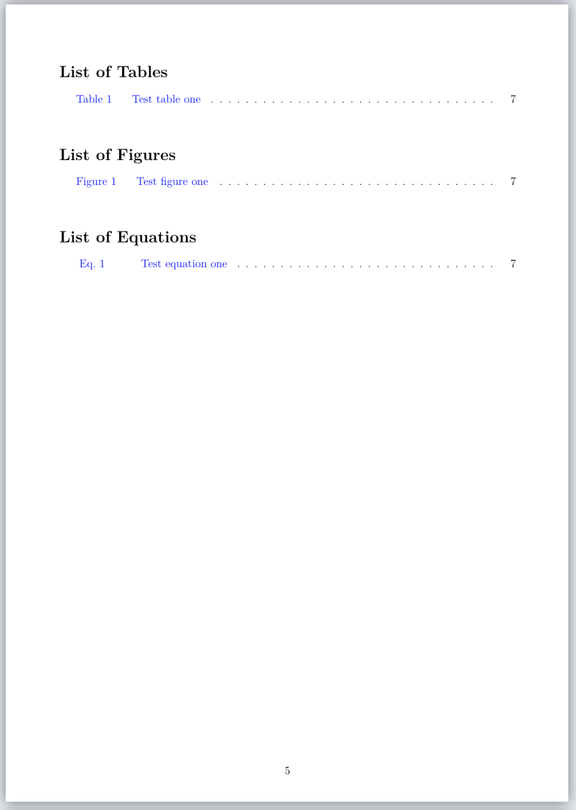
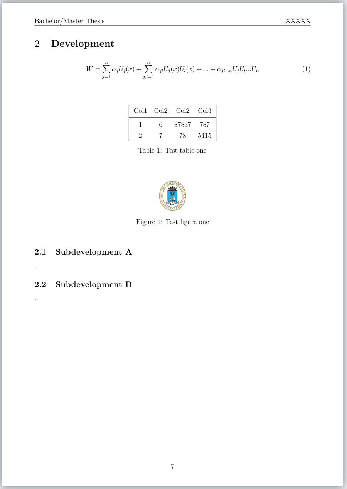

# UPM thesis template
Latex template for Universidad Politécnica de Madrid (UPM) thesis. Perfect for the Bachelors or Masters Thesis.

## Content
- Cover
- Abstract
- Resumen
- Acknowledgement
- Contents index
- List of Tables, Figures & Equations
- Introduction
- Development
- Conclusions
- References
- Annex

## Preview
Cover                         |  Contents index                        |  Tables, Figures & Equations index     |  Content example
:----------------------------:|:--------------------------------------:|:--------------------------------------:|:--------------------------------------:
 |  |  | 
